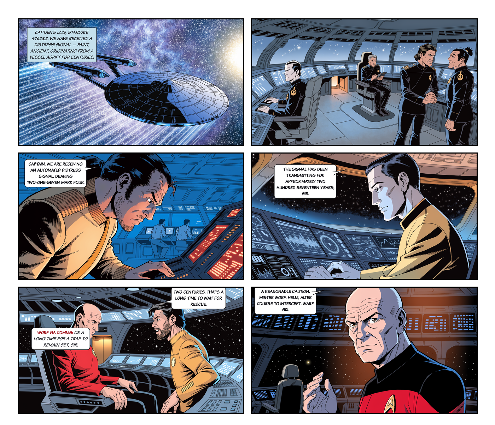

# Star Trek Graph

```
       ___________________          _-_
       \==============_=_/ ____.---'---`---.____
                   \_ \    \----._________.----/
                     \ \   /  /    `-_-'
                 __,--`.`-'..'-_
                /____          ||
                     `--.____,-'
```

[](https://github.com/Eric90403/star-trek-graph/actions/workflows/ci.yml)
[](LICENSE)
[](https://www.python.org/downloads/)
[](CHANGELOG.md)
[](https://hermes-agent.nousresearch.com)

> "The sky's the limit." — Jean-Luc Picard, *All Good Things...*

**An end-to-end Star Trek comic-book creation platform.** From a one-sentence
premise, the system retrieves canon dialogue from a 429-episode knowledge
graph, drafts a full teleplay through a four-agent writer's room, and
renders it as a publishable comic book page — art, balloons, captions,
and reading-order layout all generated automatically.



*Page 1 of "The Last Voice of Kethani" — generated end-to-end by the
platform from premise → teleplay → 6-panel comic page. Art via Recraft
V4.1 in modern IDW Mike Johnson era style, balloon placement via a
research-grounded reading-order placer, vision analysis via MiniMax M3,
panel layout via the project's own page composer. See*
[`scripts/build_page_1.py`](scripts/build_page_1.py) *and*
[`data/COMIC_TECHNIQUES_RESEARCH.md`](data/COMIC_TECHNIQUES_RESEARCH.md)
*for the design rationale.*

---

## The platform

**Story creation** (stable):

| Component | What it does |
|-----------|-------------|
| **Knowledge Graph** | 176 TNG + 80 TOS + 173 DS9 episodes loaded into Neo4j. Episodes, scenes, lines, characters, locations, ships — all connected. ~172,000 dialogue lines, ~3,000 characters. |
| **Character Chatbots** | Talk to Picard, Kirk, Sisko, Spock, Worf, Data, Quark, or any character. The LLM is grounded *exclusively* in canon dialogue + extracted behavioral cards — no hallucinated backstory. |
| **Episode Writer** | Multi-agent writer's room (Showrunner → Canon Validator → Scene Writers → Director) that generates full canon-faithful teleplays from a one-sentence premise. |
| **Browse Mode** | `./trek-browse` — explore the corpus stats, character relationships, and longest speeches without an API key. |

**Comic book creation** (beta — v0.4.1):

| Component | What it does |
|-----------|-------------|
| **Page builder** | `scripts/build_page_1.py` turns a generated teleplay into a 6-panel comic page. Story-grounded prompts, contextual panel art, balloons placed by reading-order algorithm. |
| **Recraft V4.1 art pipeline** | OpenRouter-backed `recraft/recraft-v4.1-pro` client (`src/comic/imagegen.py`). 2K resolution panels in locked IDW Mike Johnson era style. |
| **MiniMax M3 vision** | Faces, bodies, combadges, and empty-region detection. Bbox coordinates scaled from model-reported to actual image dims. |
| **Reading-order placer** | `src/comic/intelligence.py::place_balloons_for_panel`. Speaker-anchored placement per Klein/Blambot/Campbell. Eddie Campbell's Rule #3 as hard veto. Face protection as absolute hard veto. |
| **Balloon renderer** | `src/comic/balloons.py`. Pure-white rounded-rect speech balloons with curved tapered tails (Comical-JS arcTail.ts pattern). Double-outline radio balloons with inline `Speaker via Comms:` prefix in red + italic body — no tail (modern IDW Trek convention). Cyan italic caption boxes for Captain's Log. ALL CAPS in Komika Text. |
| **Page composer** | 2x3 / 3x2 / Watchmen 3x3 grid layouts at 1400px page width per Blambot industry specs. |

See [`data/COMIC_PIPELINE_DESIGN.md`](data/COMIC_PIPELINE_DESIGN.md) for
the full pipeline design and [`data/COMIC_TECHNIQUES_RESEARCH.md`](data/COMIC_TECHNIQUES_RESEARCH.md)
for the research synthesis. Sources include Blambot's industry-standard
lettering reference, Todd Klein's placement guide, Comical-JS (the
production-grade open-source comic balloon implementation), and four
academic papers on automated comic layout.

**Known limitations of the beta:** Recraft text-to-image without
reference images cannot reliably deliver specific actor likenesses.
Page 1 renders Worf as a generic human (no Klingon ridges) and Data
without his android skin tone. Picard is consistently recognizable.
Future work: Recraft `reference_image` with curated character refs,
or migration to Flux Kontext Pro.

---

## Sample episodes

Three full-length canon-faithful teleplays ship in the repo, one per
series, generated by the Episode Writer:

| Series | Episode | Premise | File |
|--------|---------|---------|------|
| TNG | "The Last Voice of Kethani" | Picard discovers a derelict ship containing the only surviving consciousness of an extinct civilization, who pleads to be uploaded into the ship's computer. | [`data/generated_episodes/SAMPLE_TNG_The_Last_Voice_of_Kethani.txt`](data/generated_episodes/SAMPLE_TNG_The_Last_Voice_of_Kethani.txt) |
| TOS | "The Blood of Kahless" | Kirk encounters a Federation colony that has adopted Klingon practices for survival, forcing him to decide whether to honor their autonomy or intervene. | [`data/generated_episodes/SAMPLE_TOS_The_Blood_of_Kahless.txt`](data/generated_episodes/SAMPLE_TOS_The_Blood_of_Kahless.txt) |
| DS9 | "Sins of the Father" | Sisko investigates when a Bajoran spiritual leader claims the Prophets have given him a vision that contradicts Federation policy. | [`data/generated_episodes/SAMPLE_DS9_Sins_of_the_Father.txt`](data/generated_episodes/SAMPLE_DS9_Sins_of_the_Father.txt) |

Each ~50,000 character teleplay was generated for ~$1.20-$1.75 in API
spend (Opus for creative passes, Sonnet for validation and metadata).
Page 1 of "The Last Voice of Kethani" (shown above) was then rendered
as a comic page for an additional ~$1.80.

---

## How it works

**GraphRAG** (Retrieval-Augmented Generation from a graph) is the
trick: instead of dumping 500,000 tokens of dialogue into the context
window, the system embeds your question, retrieves the 40 most
semantically relevant lines from Qdrant, then expands those into
structural episode context from Neo4j. ~3,500 tokens per turn instead
of 500,000+.

```
Your question
     │
     ▼
 Embed with nomic-embed-text-v1.5 (local, $0)
     │
     ├──► Qdrant (semantic)          Neo4j (structural)
     │    "lines similar to query"   "episode + relationship context"
     │                │                          │
     └────────────────┴──────────────────────────┘
                      │
                      ▼
              ~3,500 token context block
                      │
                      ▼
              Claude Opus → character response
```

**Comic book pipeline** (for each panel):

```
Teleplay scene
     │
     ▼
 PanelScript (dialogue, speakers, line types, speaker positions)
     │
     ▼
 Recraft V4.1 — generate panel art (2K, IDW Mike Johnson style)
     │
     ▼
 MiniMax M3 — vision analysis (face/body/combadge bboxes, empty regions)
     │
     ▼
 Reading-order placer — speaker-anchored balloon positions
     │   • Klein: balloons above and away from speaker
     │   • Campbell's Rule #3: reader assigns balloon to nearest face
     │   • Face protection as hard veto
     │
     ▼
 Balloon renderer — tapered-tail polygons (Comical-JS arcTail pattern)
     │
     ▼
 Page composer — 2x3 grid at 1400px page width (Blambot spec)
```

---

## Prerequisites

- **Python 3.11** (pydantic-core does not build on 3.14+ yet — use pyenv if needed)
- **Docker** (Docker Desktop on macOS/Windows, Docker Engine on Linux)
- **git**
- **Anthropic API key** for the story side — get one at [console.anthropic.com](https://console.anthropic.com/)
- **OpenRouter API key** for the comic side (Recraft V4.1 + MiniMax M3) — get one at [openrouter.ai](https://openrouter.ai/)

---

## Quickstart

### Linux / macOS

```bash
git clone https://github.com/yourname/star-trek-graph.git
cd star-trek-graph

# Install everything (Python venv + pip + Docker images)
bash install.sh

# Set your API keys
export ANTHROPIC_API_KEY=sk-ant-...
export OPENROUTER_API_KEY=sk-or-...   # only needed for the comic pipeline

# Start Neo4j
docker compose up -d

# Load TNG episodes into Neo4j (first time only, ~10 min)
.venv/bin/python scripts/ingest_tng.py

# Build vector embeddings (first time only, ~7 min on CPU)
.venv/bin/python src/embedder.py

# Talk to Picard
./trek

# Talk to Worf with more context
./trek --character WORF --top-k 60

# Generate a comic page (uses cached art if present, ~$1.80 fresh)
.venv/bin/python scripts/build_page_1.py
```

### Windows

```bat
git clone https://github.com/yourname/star-trek-graph.git
cd star-trek-graph

REM Install everything
install.bat

REM Set your API keys (PowerShell)
$env:ANTHROPIC_API_KEY = 'sk-ant-...'
$env:OPENROUTER_API_KEY = 'sk-or-...'

REM Start Neo4j
docker compose up -d

REM Load TNG episodes (first time only, ~10 min)
.venv\Scripts\python.exe scripts\ingest_tng.py

REM Build vector embeddings (first time only, ~7 min on CPU)
.venv\Scripts\python.exe src\embedder.py

REM Talk to Picard
trek
```

---

## Usage

### `./trek` — GraphRAG character chatbot

```
./trek                                Talk to Picard (default)
./trek --character WORF               Talk to Worf
./trek --character DATA               Talk to Data
./trek --character BEVERLY            Talk to Dr. Crusher
./trek --character TROI               Talk to Counselor Troi
./trek --character GEORDI             Talk to Geordi La Forge
./trek --character RIKER              Talk to Commander Riker
./trek --character KIRK --series TOS  Talk to Captain Kirk
./trek --character SPOCK --series TOS Talk to Mister Spock
./trek --character MCCOY --series TOS Talk to Doctor McCoy
./trek --top-k 60                     Retrieve 60 lines per turn (more context, slower)
./trek --model claude-sonnet-4-5      Use Sonnet instead of Opus (faster, cheaper)
```

There are also shortcut launchers:

```
./picard   →  ./trek --character PICARD
./kirk     →  ./trek --character KIRK --series TOS
```

The agent retrieves only the lines most relevant to your current question —
efficient, accurate, and it scales to any character in the corpus.

Every character responds from canon dialogue only. If you ask Worf about something
not in the graph, he'll tell you he has no record of it. That's the point.

### `./trek-browse` — No API key required

```
./trek-browse                         Corpus overview + top characters
./trek-browse PICARD                  Character detail (lines, partners, top quotes)
./trek-browse SISKO --series DS9
./trek-browse --episode tos:42        Episode detail (cast, notable lines)
```

Renders horizontal-bar charts straight from Neo4j. Great for poking
at the corpus before you commit to setting up an Anthropic key.

### `./write-episode` — Multi-agent Episode Writer

Generates a full canon-faithful teleplay from a single premise.
Four agents collaborate: a Showrunner outlines, a Canon Validator
flags continuity issues, Scene Writers (one per scene) draft the
dialogue using each character's Behavioral Card and a fresh
retrieval of canon lines, and a Director assembles the final teleplay
with act structure, teaser narration, and a tag scene.

```bash
./write-episode \
    --premise "Picard discovers a derelict ship containing the only
               surviving consciousness of an extinct civilization,
               who pleads to be uploaded into the ship's computer..." \
    --series TNG \
    --characters PICARD,RIKER,DATA,WORF,TROI,BEVERLY \
    --scenes 5
```

Cost: ~$1.20–$1.75 per episode (Opus for creative passes,
Sonnet for validation and metadata). The teleplay and a JSON
sidecar with the full outline+metadata are saved to
`data/generated_episodes/`.

### `scripts/build_page_1.py` — Comic page builder (beta)

Generates the 6-panel Page 1 of "The Last Voice of Kethani" end-to-end.
Each panel runs through the full pipeline: Recraft V4.1 art generation,
MiniMax M3 vision analysis, reading-order balloon placement, and 2x3
grid composition.

```bash
# Generate the full page (~$1.80 in OpenRouter spend if no cache)
.venv/bin/python scripts/build_page_1.py
```

Output:
- `data/poc_comic/stage3/PAGE_1.png` — composed page (1400×2165)
- `data/poc_comic/stage3/p{1-6}_ART.png` — raw Recraft art
- `data/poc_comic/stage3/p{1-6}_FINAL.png` — art with balloons

The page builder is the entry point. Underneath it: `src/comic/imagegen.py`
(Recraft client), `src/comic/intelligence.py` (vision + placer),
`src/comic/balloons.py` (renderer), `src/comic/panel_script.py`
(data model), `src/comic/page.py` (page composer).

### Ingest scripts

```bash
# TNG: fetch 176 scripts from st-minutiae.com, parse, load into Neo4j
.venv/bin/python scripts/ingest_tng.py

# TOS: fetch 80 transcripts from chakoteya.net, parse, load into Neo4j
.venv/bin/python scripts/ingest_tos.py

# Embed everything in Neo4j into Qdrant
.venv/bin/python src/embedder.py

# Embed only one series (recommended for incremental updates)
.venv/bin/python src/embedder.py --series TOS

# Embed only one character
.venv/bin/python src/embedder.py --speaker PICARD

# Dry run — count lines without embedding
.venv/bin/python src/embedder.py --dry-run

# Reset and rebuild the collection from scratch
.venv/bin/python src/embedder.py --reset
```

---

## Sample Queries (Neo4j Browser)

Open Neo4j Browser at **http://localhost:7475** (username: `neo4j`, password: `trekgraph`).

```cypher
-- How many lines does each character have?
MATCH (l:Line)-[:SPOKEN_BY]->(c:Character)
RETURN c.canonical_name AS character, count(l) AS lines
ORDER BY lines DESC LIMIT 20

-- What episodes feature both Worf and Gowron?
MATCH (w:Character {canonical_name: "WORF"})-[:APPEARS_IN]->(e:Episode)
MATCH (g:Character {canonical_name: "GOWRON"})-[:APPEARS_IN]->(e)
RETURN e.title, e.stardate ORDER BY e.stardate

-- Find all of Picard's lines mentioning duty
MATCH (l:Line)-[:SPOKEN_BY]->(c:Character {canonical_name: "PICARD"})
WHERE toLower(l.text) CONTAINS "duty"
RETURN l.text LIMIT 25

-- Who shares the most scenes with Data?
MATCH (data:Character {canonical_name: "DATA"})<-[:SPOKEN_BY]-(:Line)
      -[:IN_SCENE]->(s:Scene)<-[:IN_SCENE]-(:Line)
      -[:SPOKEN_BY]->(other:Character)
WHERE other.canonical_name <> "DATA"
WITH other.canonical_name AS partner, count(DISTINCT s) AS scenes
ORDER BY scenes DESC LIMIT 10
RETURN partner, scenes

-- Episode stats: lines per episode, Season 2
MATCH (e:Episode {season: 2})<-[:IN_EPISODE]-(:Scene)<-[:IN_SCENE]-(l:Line)
RETURN e.title, count(l) AS lines ORDER BY lines DESC
```

Full sample query file: `scripts/sample_queries.cypher`

---

## Architecture

Two complementary stores, one retrieval pattern:

```
                   ┌─────────────────────────────────────┐
                   │           USER QUESTION              │
                   └──────────────┬──────────────────────┘
                                  │ natural language
                         ┌────────▼────────┐
                         │   Retriever     │  src/retriever.py
                         │  (GraphRAG)     │
                         └──┬──────────┬───┘
                            │          │
             ┌──────────────▼──┐    ┌──▼──────────────────┐
             │     Qdrant      │    │       Neo4j          │
             │  trek_lines     │    │   trek-neo4j         │
             │  (semantic)     │    │   (structural)       │
             │                 │    │                      │
             │ vector search   │    │ graph traversal      │
             │ "similar to X"  │    │ "related to X"       │
             │                 │    │                      │
             │ port 6333       │    │ port 7688 (bolt)     │
             │                 │    │ port 7475 (browser)  │
             └─────────────────┘    └──────────────────────┘
```

Neo4j and Qdrant answer different questions:

| Store  | Question type | Example |
|--------|--------------|---------|
| Neo4j  | Structural / relational | "What episodes feature both Worf and Gowron?" |
| Qdrant | Semantic / similarity   | "Find lines where Picard talks about duty and sacrifice" |

### Data Pipeline

```
st-minutiae.com                    Neo4j              Qdrant
(plain text scripts)               (graph)            (vectors)

  scripts/fetch_scripts.py  →  data/raw/{id}.txt
  src/parser.py             →  data/parsed/{id}.json
  src/loader.py             →  Episode, Scene,   ─────────────┐
                               Line, Character,               │
                               Location, Ship                 │
                                                              │
  src/embedder.py  ────────────────────────────────────────── ┘
  (reads from Neo4j, embeds with nomic-embed-text-v1.5,
   pushes to Qdrant with full graph metadata as payload)
```

### Graph Schema (Layer 1)

```
(Line)      -[:SPOKEN_BY]->   (Character)
(Line)      -[:IN_SCENE]->    (Scene)
(Scene)     -[:IN_EPISODE]->  (Episode)
(Scene)     -[:SET_AT]->      (Location)
(Episode)   -[:FEATURES_SHIP]->(Ship)
(Character) -[:APPEARS_IN]->  (Episode)
```

Full schema spec: `docs/ONTOLOGY.md`

### Embedding Model

**nomic-ai/nomic-embed-text-v1.5** — runs locally, costs $0.

- 768 dimensions, 8192 token context
- Apache 2.0 license
- Beats OpenAI text-embedding-ada-002 on MTEB
- ~500–800 lines/sec on CPU (i7-8850H)
- Device auto-detected: CUDA > MPS (Apple Silicon) > CPU

---

## Corpus Status

| Source | Episodes | Lines | Characters | Status |
|--------|----------|-------|------------|--------|
| TOS (all 3 seasons) | 80  | 29,316  | 472   | ✅ loaded + embedded |
| TNG (all 7 seasons) | 176 | 70,544  | 2,143 | ✅ loaded + embedded |
| DS9 (all 7 seasons) | 173 | 72,160  | ~1,000 | ✅ loaded + embedded |
| TNG Films | 4 | — | — | Phase 3+ |
| Voyager | 172 | — | — | Phase 4+ |

Top characters by line count: Picard (13,763), Riker (7,941), Data (6,837),
Worf (5,088), Troi (4,991), Geordi (4,721), Beverly (3,892).

---

## Roadmap

See `docs/PLAN.md` for the full phased roadmap with status. The short version:

- **Phase 1** (done): 5-episode spike, parser, loader, Picard full-context agent
- **Phase 2** (done): Full TNG corpus, GraphRAG retriever, character_agent
- **Phase 3** (done): DS9 + behavioral cards
- **Phase 4** (done): Multi-agent Episode Writer with canon validation; three sample episodes ship in the repo
- **Phase 5** (in progress, v0.4.1): Comic book rendering platform — Page 1 done. Next: multi-page rendering, character reference images for likeness consistency, PDF / CBZ export.
- **Phase 6**: Voyager + Enterprise + TNG Films ingest, character relationship graph, fan-canon tier

---

## Contributing

PRs welcome! Star Trek nerds with software chops are exactly the people
this project needs. The workflow:

1. **Fork** the repo (button at top-right of the GitHub page)
2. **Clone your fork**, create a branch (`git checkout -b my-feature`)
3. **Read** `AGENTS.md` and `CONTRIBUTING.md` — they explain conventions
4. **Make your changes**, commit, push to your fork
5. **Open a Pull Request** against `Eric90403/star-trek-graph:main`
6. CI will auto-run (Linux + macOS + Windows × Python 3.11/3.12)
7. We discuss, iterate if needed, then merge

For larger changes (new corpora, schema changes, anything touching the
Episode Writer architecture or the comic pipeline), **please open an Issue first** so we can
align on approach before you sink time into it.

`main` is protected: PRs require CI to pass and at least one review.
The repo owner retains bypass for solo housekeeping (doc tweaks,
version bumps); contributor work goes through PRs. This isn't
gatekeeping — it's how we keep the release artifacts (sample episodes,
embedded corpus, validated agents, rendered comic pages) honest and
reproducible.

Ideas especially welcome:
- Voyager / Enterprise / TNG Films ingest
- Location normalization (`data/location_aliases.yaml`)
- Behavioral cards for more characters
- Local-LLM mode for the Episode Writer (Ollama / vLLM)
- Comic-side: Recraft `reference_image` integration for character likeness; Flux Kontext Pro alternative renderer; PDF / CBZ export
- A web UI
- Telegram / Discord bot wrappers

See `CONTRIBUTING.md` for the full guide.

---

## License & Attribution

Code: MIT License — see LICENSE.

**Star Trek IP notice:** Star Trek, The Next Generation, and all character
names are trademarks and copyright of CBS Studios / Paramount Global.
This project is a fan work for educational and research purposes only.
No commercial use. No redistribution of episode scripts or generated
comic pages.

**Script source:** Episode scripts were scraped from
[st-minutiae.com](https://www.st-minutiae.com/resources/scripts/) with
respect for their terms of service. Do not redistribute the raw `.txt` files.

**Comic art:** Panel art is generated procedurally by Recraft V4.1 Pro
via OpenRouter. Generated images are fan-made works for personal /
educational use only. Character likenesses are property of the
respective rights holders.

---

## Built with Hermes Agent

> This project was designed and built interactively with
> **[Hermes Agent](https://hermes-agent.nousresearch.com)** (Nous Research)
> running Claude Opus on Ubuntu Linux (kernel 7.0.0-15-generic).
> The architecture, graph schema, parser, loader, embedder, retriever,
> character agents, Episode Writer, comic book rendering pipeline, and
> all documentation were generated in interactive sessions.
> Author: Eric Stewart.

Hermes Agent is an AI agent platform by [Nous Research](https://nousresearch.com)
that lets you work with Claude and other LLMs via a persistent, tool-using agent
session — with file editing, terminal access, and skill memory.
